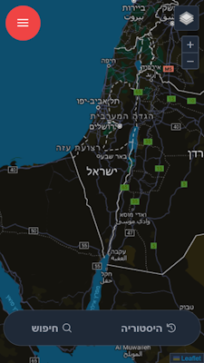
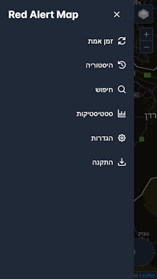
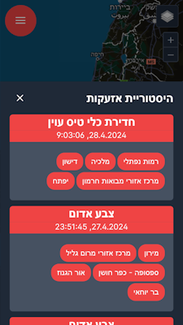
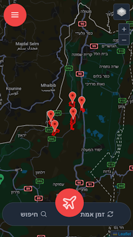
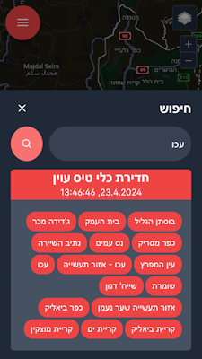
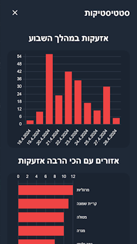

# Red Alert Map

https://red-alert-map.netlify.app/

Red Alert Map is an application that displays real-time rocket alerts in Israel on a map. The app utilizes real-time alert data provided by Pikud HaOref.

> [!IMPORTANT]  
> As of 24/4/2026, the app itself is no longer usable due to the backend being hosted on Vercel, which has exhausted my free plan.

## Showcase

https://github.com/user-attachments/assets/efc6363f-2abd-4546-9d2e-17215c2365b2

## Gallery

